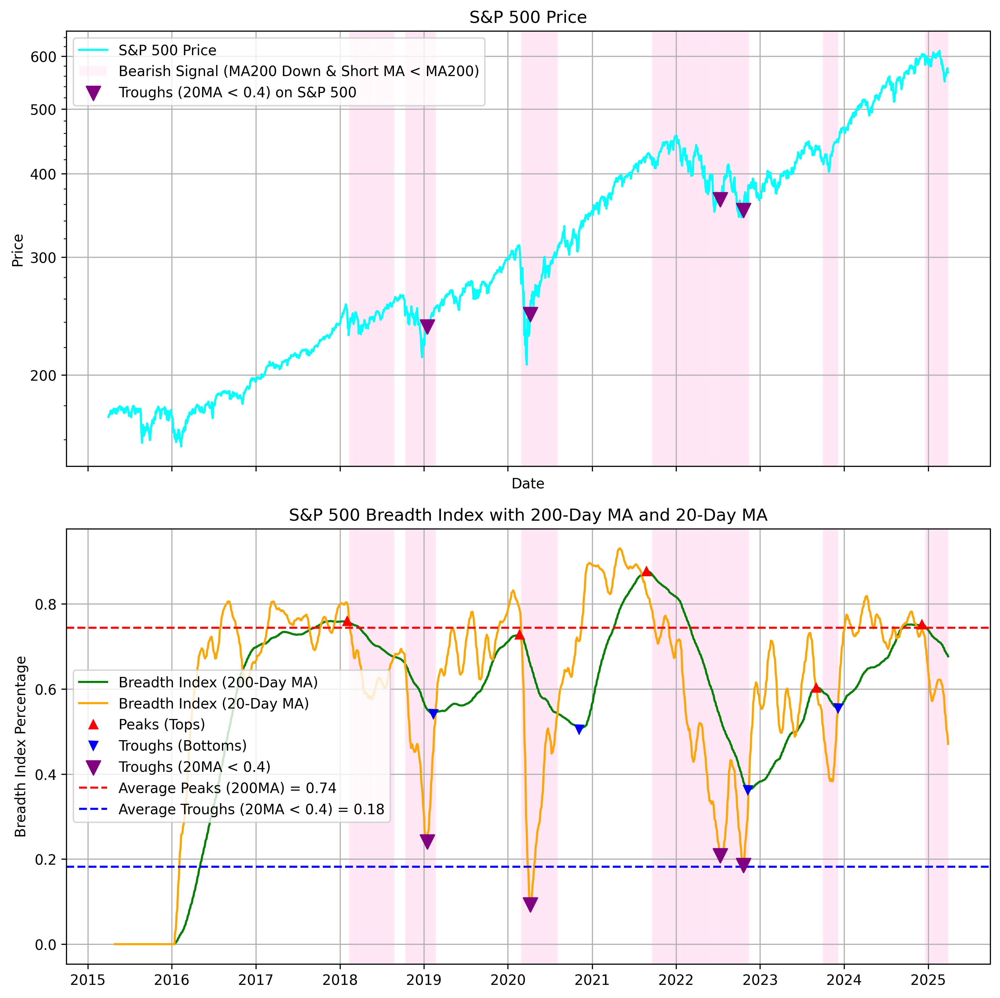

# Market Breadth Analysis Tool

[日本語版はこちら](README-ja.md)

A tool for analyzing and visualizing the market breadth of S&P500 stocks.

## Features

- Fetch price data for all S&P500 stocks
- Calculate breadth indicators based on 200-day moving average
- Visualize breadth indicators and S&P500 price movements
- Identify trend reversal points through peak detection
- Save and reuse historical data without requiring an API key
- Backtest trading strategies based on market breadth signals
- Multi-ETF backtesting capabilities
- Detailed trade logging with 15 data points per trade (entry/exit dates, prices, P&L, etc.)
- Export trade logs to CSV for external analysis

## Live Data (GitHub Pages)

The latest market breadth data is automatically updated twice daily and published to GitHub Pages:

| Resource | URL |
|---|---|
| Interactive Chart | [market_breadth.html](https://tradermonty.github.io/market-breadth-analysis/market_breadth.html) |
| Dashboard | [index.html](https://tradermonty.github.io/market-breadth-analysis/) |
| Data CSV | [market_breadth_data.csv](https://tradermonty.github.io/market-breadth-analysis/market_breadth_data.csv) |
| Summary CSV | [market_breadth_summary.csv](https://tradermonty.github.io/market-breadth-analysis/market_breadth_summary.csv) |

## Prerequisites

- Python 3.8 or higher
- Required Python packages (listed in requirements.txt)
- API Keys (Optional):
  - FMP API Key (Financial Modeling Prep)
    - Pricing & docs: https://site.financialmodelingprep.com/developer/docs/
    - Not required if using saved data
  - GitHub Token (for triggering workflow updates)
    - Fine-grained PAT with Actions: Read and write permission
    - Only needed for `trigger_market_breadth.py`

## Installation

1. Clone the repository:
```bash
git clone [repository-url]
cd market_breadth
```

2. Install required packages:
```bash
pip install -r requirements.txt
```

3. Set up environment variables (Optional):
Copy the `.env.sample` file to `.env` and edit it:
```bash
cp .env.sample .env
```
```
FMP_API_KEY=your_fmp_api_key        # For fetching fresh stock data from FMP
GITHUB_TOKEN=your_github_pat_here   # For triggering workflow updates (optional)
```

## Usage

### Market Breadth Analysis

Basic usage (requires API key):
```bash
python market_breadth.py
```

Using saved data:
```bash
python market_breadth.py --use_saved_data
```

With additional options:
```bash
python market_breadth.py --start_date 2020-01-01 --short_ma 20 --use_saved_data
```

### Backtesting

Single symbol backtesting:
```bash
# Basic backtest with trade logging
python backtest/backtest.py --symbol SPY --use_saved_data

# Backtest with custom parameters
python backtest/backtest.py --symbol SSO --start_date 2020-01-01 --end_date 2023-12-31 --stop_loss_pct 0.08 --use_saved_data

# Debug mode to see detailed trade matching
python backtest/backtest.py --symbol QQQ --debug --use_saved_data
```

Multi-ETF backtesting (automatically generates trade logs for each symbol):
```bash
# Run from project root to save outputs to reports/ directory
python backtest/run_multi_etf_backtest.py

# NOTE: Always run from the project root directory
# Running with 'cd backtest' will save outputs to backtest/reports/ instead
```

### Fetching Data / Triggering Workflow

Fetch the latest market breadth data from GitHub Pages, or trigger a workflow update if data is stale:

```bash
# Auto mode: fetch if fresh, trigger workflow if stale (default: 12h threshold)
python trigger_market_breadth.py

# Fetch CSV data only (no workflow trigger)
python trigger_market_breadth.py --fetch-only

# Force trigger the GitHub Actions workflow
python trigger_market_breadth.py --trigger-only

# Custom staleness threshold (6 hours)
python trigger_market_breadth.py --max-age 6
```

Use from Python (e.g., LLM integration):
```python
from trigger_market_breadth import fetch_market_breadth

result = fetch_market_breadth(max_age_hours=12)
if result["status"] == "fresh":
    csv_data = result["csv_text"]  # Ready to analyze
elif result["status"] == "triggered":
    print(result["message"])  # "Workflow triggered. Data will be ready in ~5 minutes."
```

### Analyzing Trade Logs

After running a backtest, trade logs are saved to `reports/trade_log_{SYMBOL}_{START}_{END}.csv`. You can analyze them with:

```python
import pandas as pd

# Load trade log
df = pd.read_csv('reports/trade_log_SPY_2020-01-01_2023-12-31.csv')

# View summary statistics
print(f"Total Trades: {len(df)}")
print(f"Win Rate: {(df['pnl_dollar'] > 0).sum() / len(df) * 100:.1f}%")
print(f"Average P&L: ${df['pnl_dollar'].mean():.2f}")
print(f"Total P&L: ${df['pnl_dollar'].sum():.2f}")

# Analyze by entry reason
print(df.groupby('entry_reason')['pnl_dollar'].agg(['count', 'mean', 'sum']))
```

### Command Line Arguments

#### Market Breadth Analysis
- `--start_date`: Start date for analysis (YYYY-MM-DD format)
  - Default: 10 years ago from today
- `--short_ma`: Short-term moving average period (10 or 20)
- `--use_saved_data`: Use previously saved data instead of fetching from FMP

#### Backtesting
- `--start_date`: Start date for backtesting (YYYY-MM-DD)
- `--end_date`: End date for backtesting (YYYY-MM-DD)
- `--symbol`: Symbol to backtest (e.g., SPY, QQQ, SSO)
- `--initial_capital`: Initial capital for backtesting (default: 50000)
- `--stop_loss_pct`: Stop loss percentage (default: 0.08)
- `--use_trailing_stop`: Enable trailing stop instead of fixed stop
- `--trailing_stop_pct`: Trailing stop percentage (default: 0.2)
- `--ma_type`: Moving average type: 'ema' or 'sma' (default: ema)
- `--debug`: Enable debug mode with verbose output
- `--no_show_plot`: Save charts without displaying (useful for batch processing)

### Data Storage and Reuse

The tool now supports saving and reusing historical data:

- Data is stored in the `data/` directory:
  - `sp500_price_data.csv`: S&P 500 index price data
  - `stock_data.csv`: Individual stock price data for all S&P 500 companies

Workflow:
1. First-time use (requires API key):
   - Run without `--use_saved_data` to fetch and save data
   - Data is automatically saved for future use
2. Subsequent use:
   - Run with `--use_saved_data` to use previously saved data
   - No API key required
   - Faster execution as no API calls are made

Note: To update the saved data with fresh market data, run without `--use_saved_data` (requires API key).

### Data Source

Financial Modeling Prep (FMP)
- Provides US & global stock, ETF, and fundamental data
- Free "demo" key available (limited speed / features)
- Higher-tier plans unlock higher rate limits & historical coverage
- S&P 500 ticker list is fetched from Wikipedia
- Documentation: https://site.financialmodelingprep.com/developer/docs/

## Output

The following files are generated in the `reports/` directory:
- `market_breadth_YYYYMMDD.png`: Graph showing breadth indicators and S&P500 price movements
- `market_breadth_YYYYMMDD.csv`: Numerical data of breadth indicators
- `backtest_results_{SYMBOL}.png`: Individual backtest chart for each symbol
- `trade_log_{SYMBOL}_{START}_{END}.csv`: Detailed trade log with 15 columns per trade
- `backtest_results_summary.md`: Detailed results report in Markdown format
- `backtest_results_summary.csv`: Results data in CSV format

### Trade Log Format

Each trade log CSV contains the following columns:
- `trade_id`: Sequential trade number
- `entry_date`, `entry_price`, `entry_shares`, `entry_cost`: Entry details
- `entry_reason`: Signal that triggered entry (e.g., "short_ma_bottom", "long_ma_bottom")
- `exit_date`, `exit_price`, `exit_shares`, `exit_proceeds`: Exit details
- `exit_reason`: Signal that triggered exit (e.g., "peak exit", "stop loss")
- `holding_days`: Number of days position was held
- `pnl_dollar`: Profit/loss in dollars
- `pnl_percent`: Profit/loss as percentage
- `cumulative_pnl`: Running total of all profits/losses

### Graph Color Coding

The pink background in the graph indicates the following conditions:
- 200-day moving average trend is declining (breadth_ma_200_trend[i] == -1)
- Short-term moving average is below the 200-day moving average (breadth_ma_short[i] < breadth_ma_200[i])

This color coding helps visually identify market downtrends and weakness.

### Sample Output

```
market_breadth_20240315.png
```


In the sample graph above:
- Blue line: S&P500 price movement (logarithmic scale)
- Red line: Breadth indicator (percentage of stocks above 200-day moving average)
- Pink background: Area indicating market strength and trend direction
- Black dots: Peak points (market reversal points)

## Development Setup

### Pre-Commit Hooks

This project uses pre-commit hooks to enforce code quality:

```bash
pip install pre-commit
pre-commit install
```

After setup, the following checks run automatically on every commit:
- **ruff**: Linting and formatting (replaces flake8/isort/black)
- **codespell**: Spell checking
- **bandit**: Security scanning (SAST)
- **detect-secrets**: Credential leak prevention
- Trailing whitespace, EOF fixes, YAML validation

To run all hooks manually:
```bash
pre-commit run --all-files
```

### CI Pipeline

GitHub Actions CI runs on PRs and pushes to `main` with three jobs:
- **lint**: ruff check + format check + codespell
- **security**: bandit + pip-audit + detect-secrets
- **test**: Unit tests (no API key required)

## System Requirements

- macOS: TkAgg backend
- Windows: Qt5Agg backend
- Linux: Agg backend (non-interactive)
- Minimum 8GB RAM recommended for backtesting
- SSD storage recommended for faster data access

## Notes

- Keep your API key in the `.env` file and do not upload it to GitHub
- Some FMP endpoints require a paid plan
- Check FMP terms for commercial usage
- Backtesting results are for educational purposes only
- Past performance does not guarantee future results

## License

MIT License

Copyright (c) 2024 Market Breadth Analysis Tool

Permission is hereby granted, free of charge, to any person obtaining a copy
of this software and associated documentation files (the "Software"), to deal
in the Software without restriction, including without limitation the rights
to use, copy, modify, merge, publish, distribute, sublicense, and/or sell
copies of the Software, and to permit persons to whom the Software is
furnished to do so, subject to the following conditions:

The above copyright notice and this permission notice shall be included in all
copies or substantial portions of the Software.

THE SOFTWARE IS PROVIDED "AS IS", WITHOUT WARRANTY OF ANY KIND, EXPRESS OR
IMPLIED, INCLUDING BUT NOT LIMITED TO THE WARRANTIES OF MERCHANTABILITY,
FITNESS FOR A PARTICULAR PURPOSE AND NONINFRINGEMENT. IN NO EVENT SHALL THE
AUTHORS OR COPYRIGHT HOLDERS BE LIABLE FOR ANY CLAIM, DAMAGES OR OTHER
LIABILITY, WHETHER IN AN ACTION OF CONTRACT, TORT OR OTHERWISE, ARISING FROM,
OUT OF OR IN CONNECTION WITH THE SOFTWARE OR THE USE OR OTHER DEALINGS IN THE
SOFTWARE.
