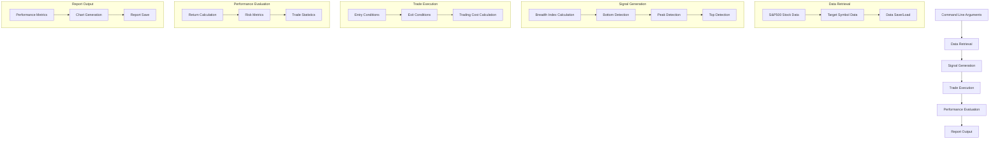
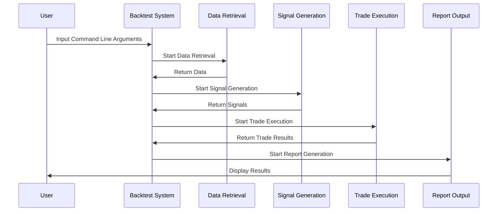
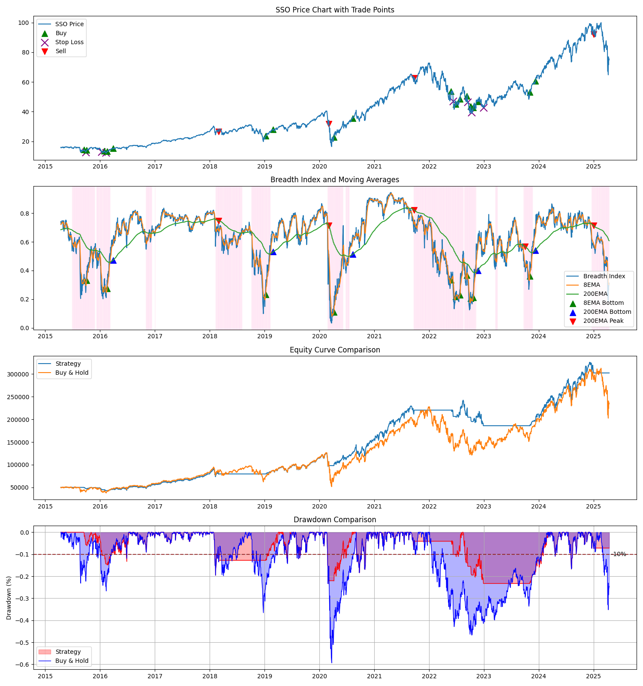

# Backtest System Design Document

## 1. Overview
A backtest system using market breadth indicators. Calculates the Breadth Index using data from all S&P500 stocks and generates trading signals for SSO.

## 2. System Configuration

### 2.1 Command Line Arguments
- `--start_date`: Backtest start date (YYYY-MM-DD format)
  - If not specified, uses a date 10 years before the end date
  - Actual data retrieval starts 2 years before the start date (for moving average calculation)
- `--end_date`: Backtest end date (YYYY-MM-DD format)
  - If not specified, uses the current date
- `--short_ma`: Short-term moving average period (default: 8)
- `--long_ma`: Long-term moving average period (default: 200)
- `--initial_capital`: Initial investment amount (default: $50,000)
- `--slippage`: Slippage (default: 0.1%)
- `--commission`: Trading commission (default: 0.1%)
- `--use_saved_data`: Whether to use saved data
- `--debug`: Enable debug mode
  - Display basic information during data retrieval (number of tickers retrieved, data period)
  - Display basic information during signal detection (bottoms, peaks, and their detection dates)
  - Display basic information during trade execution (trading price, trading volume)
- `--threshold`: Threshold for bottom detection (default: 0.5)
- `--ma_type`: Type of moving average ('ema' or 'sma', default: 'ema')
- `--symbol`: Trading target symbol (default: 'SSO')
- `--stop_loss_pct`: Stop loss percentage (default: 10%)
- `--disable_short_ma_entry`: Disable entry based on short-term moving average
- `--use_trailing_stop`: Whether to use trailing stop
- `--trailing_stop_pct`: Trailing stop percentage (default: 20%)
- `--background_exit_threshold`: Exit threshold when background color changes (default: 0.5)
- `--use_background_color_signals`: Whether to use signals based on background color changes
- `--partial_exit`: Whether to sell only half of the holdings during exit
- `--no_show_plot`: Whether not to display the plot

### 2.2 Data Retrieval
- Retrieve data for all S&P500 stocks (for Breadth Index calculation)
- Retrieve data for the trading target symbol (default is SSO)
- Data is retrieved and saved using functions from `../market_breadth.py`
- Prioritize using saved data with the `--use_saved_data` option

### 2.3 Signal Generation
- Breadth Index calculation
  - Calculate moving averages for all S&P500 stocks (short-term and long-term)
  - Calculate the percentage of stocks above their moving averages
- Bottom detection
  - Short-term moving average (20MA) bottom detection
    - Extract data where Breadth Index falls below the threshold
    - Confirm that the minimum Market Breadth value over the past 20 days is below 0.3
    - Detect bottoms from the extracted data
  - Long-term moving average (200MA) bottom detection
    - Detect bottom values of the moving average line
- Peak detection
  - After bottom detection, extract data where Breadth Index exceeds 0.6
  - Detect peaks from the extracted data
- Top detection
  - After peak detection, extract data where Breadth Index falls below 0.5
  - Detect tops from the extracted data

### 2.4 Trade Execution
- Entry conditions
  - When short-term moving average bottom is detected (can be disabled with an option)
  - When long-term moving average bottom is detected
- Exit conditions
  - When top is detected
  - Stop loss condition (optional)
  - Trailing stop (optional)
  - Exit based on background color change (optional)
- Consideration of trading costs
  - Slippage: 0.1% (default)
  - Trading commission: 0.1% (default)

### 2.5 Performance Evaluation
- Total return
- Annualized return
- Maximum drawdown
- Sharpe ratio
- Win rate
- Profit-loss ratio
- Profit factor
- Calmar ratio
- Expected value
- Average profit/loss per trade
- Pareto ratio

### 2.6 Report Output
- Display performance metrics
- Generate charts
  - Price chart of the trading target symbol
  - Breadth Index chart
  - Moving average lines (short-term and long-term)
  - Display of trading signals
  - Trend display using background color
- Reports are saved in the `../reports` directory

## 3. Dependencies
- `../market_breadth.py`: Provides basic functions such as data retrieval and Breadth Index calculation
- `pandas`: Data processing
- `numpy`: Numerical computation
- `matplotlib`: Chart generation
- `scipy`: Peak detection
- `EODHD`: Stock price data retrieval API

## 4. Multi-ETF Backtest Functionality

### 4.1 Overview
Provides functionality to execute backtests on multiple ETFs simultaneously and compare their results.

### 4.2 Main Features
- Parallel execution of backtests for multiple ETFs
- Output results in both Markdown table and CSV file formats
- Error handling functionality (continues processing even if errors occur for some ETFs)
- Implementation of wait time considering API request limits

### 4.3 Output Results
Calculates and outputs the following metrics for each ETF in a comparison table:
- Total Return
- Annual Return (CAGR)
- Sharpe Ratio
- Maximum Drawdown
- Win Rate
- Profit-Loss Ratio
- Profit Factor
- Calmar Ratio
- Expected Value
- Average Profit/Loss per Trade
- Pareto Ratio

### 4.4 Target ETFs
ETFs are categorized as follows:
- US Stock Market Diversification ETFs (SPY, VOO, VTI, etc.)
- Sector ETFs (XLF, XLE, XLK, etc.)
- Leveraged Bull ETFs (SSO, TQQQ, etc.)
- Small/Mid Cap ETFs (TNA, IWR, etc.)
- Growth ETFs (SCHG, IWF, etc.)
- Factor ETFs (MTUM, etc.)
- Dividend-Focused ETFs (VYM, SCHD, etc.)

### 4.5 Output Files
- `../reports/backtest_results_summary.md`: Detailed results report in Markdown format
- `../reports/backtest_results_summary.csv`: Results data in CSV format
- `../reports/backtest_result_sample.png`: Sample chart showing price action, breadth index, and trading signals

### 4.6 Parameters
- `etfs`: List of ETF symbols for backtesting
- `start_date`: Backtest start date (YYYY-MM-DD format)
- `end_date`: Backtest end date (YYYY-MM-DD format)
- `short_ma`: Short-term moving average period (default: 20)
- `long_ma`: Long-term moving average period (default: 200)
- `initial_capital`: Initial investment amount (default: $50,000)
- `slippage`: Slippage rate (default: 0.1%)
- `commission`: Trading commission rate (default: 0.1%)
- `use_saved_data`: Whether to use saved data (default: True)
- `debug`: Debug mode (default: False)
- `threshold`: Threshold for bottom detection (default: 0.5)
- `ma_type`: Type of moving average ('ema' or 'sma', default: 'ema')
- `stop_loss_pct`: Stop loss percentage (default: 10%)
- `no_show_plot`: Whether not to display plots (default: True)
