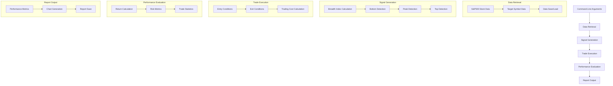
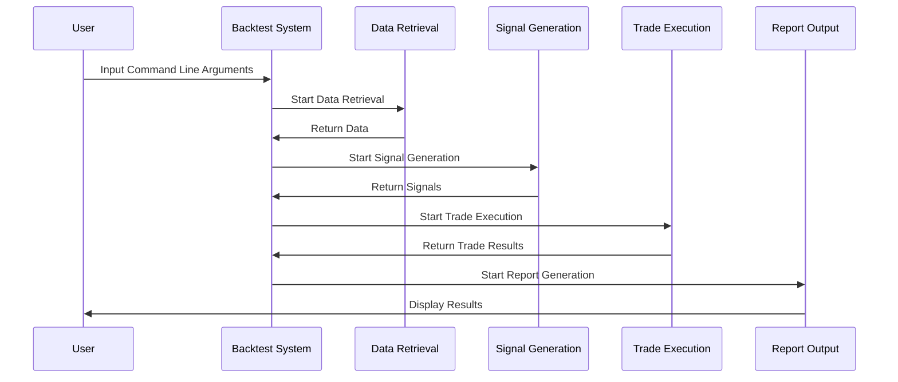
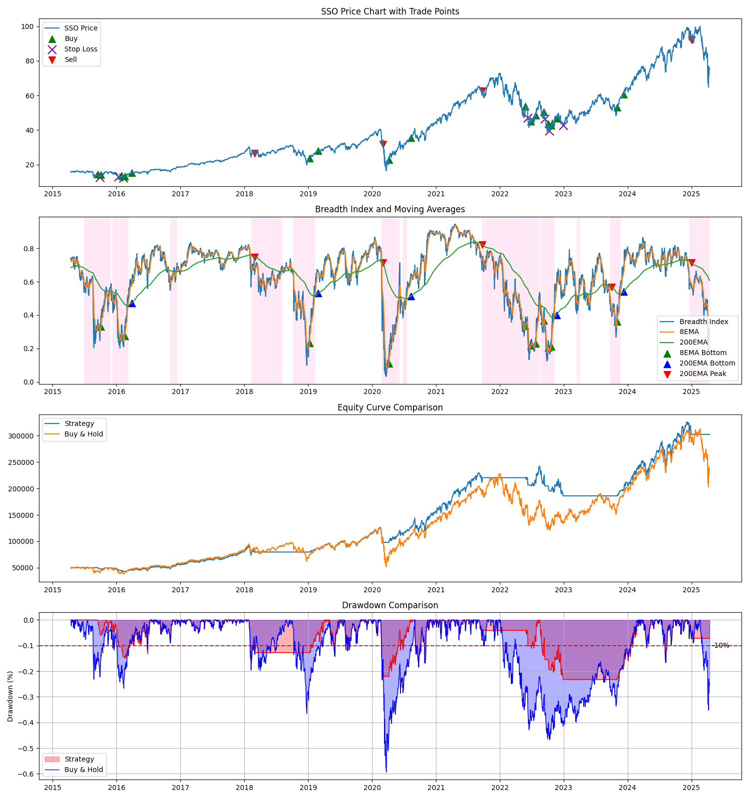

# Backtest System Design Document

## 1. Overview
A backtest system using market breadth indicators. Calculates the Breadth Index using data from all S&P500 stocks and generates trading signals for SSO.

```mermaid
graph TD
    A[Command Line Arguments] --> B[Data Retrieval]
    B --> C[Signal Generation]
    C --> D[Trade Execution]
    D --> E[Performance Evaluation]
    E --> F[Report Output]

    subgraph Data Retrieval
    B1[S&P500 Stock Data] --> B2[Target Symbol Data]
    B2 --> B3[Data Save/Load]
    end

    subgraph Signal Generation
    C1[Breadth Index Calculation] --> C2[Bottom Detection]
    C2 --> C3[Peak Detection]
    C3 --> C4[Top Detection]
    end

    subgraph Trade Execution
    D1[Entry Conditions] --> D2[Exit Conditions]
    D2 --> D3[Trading Cost Calculation]
    end

    subgraph Performance Evaluation
    E1[Return Calculation] --> E2[Risk Metrics]
    E2 --> E3[Trade Statistics]
    end

    subgraph Report Output
    F1[Performance Metrics] --> F2[Chart Generation]
    F2 --> F3[Report Save]
    end
```

```mermaid
sequenceDiagram
    participant User
    participant System as Backtest System
    participant Data as Data Retrieval
    participant Signal as Signal Generation
    participant Trade as Trade Execution
    participant Report as Report Output

    User->>System: Input Command Line Arguments
    System->>Data: Start Data Retrieval
    Data->>System: Return Data
    System->>Signal: Start Signal Generation
    Signal->>System: Return Signals
    System->>Trade: Start Trade Execution
    Trade->>System: Return Trade Results
    System->>Report: Start Report Generation
    Report->>User: Display Results
```

## 2. System Configuration

### 2.1 Command Line Arguments

#### Basic Parameters
- `--start_date`: Backtest start date (YYYY-MM-DD format)
  - If not specified, uses a date 10 years before the end date
  - Actual data retrieval starts 2 years before the start date (for moving average calculation)
- `--end_date`: Backtest end date (YYYY-MM-DD format)
  - If not specified, uses the current date
- `--short_ma`: Short-term moving average period (default: 5)
- `--long_ma`: Long-term moving average period (default: 200)
- `--initial_capital`: Initial investment amount (default: $50,000)
- `--slippage`: Slippage (default: 0.05%)
- `--commission`: Trading commission (default: 0.01%)
- `--use_saved_data`: Whether to use saved data
- `--debug`: Enable debug mode
  - Display basic information during data retrieval (number of tickers retrieved, data period)
  - Display basic information during signal detection (bottoms, peaks, and their detection dates)
  - Display basic information during trade execution (trading price, trading volume)
- `--threshold`: Threshold for bottom detection (default: 0.5)
- `--ma_type`: Type of moving average ('ema' or 'sma', default: 'ema')
- `--symbol`: Trading target symbol (default: 'SSO')
- `--stop_loss_pct`: Stop loss percentage (default: 8%)
- `--disable_short_ma_entry`: Disable entry based on short-term moving average
- `--use_trailing_stop`: Whether to use trailing stop
- `--trailing_stop_pct`: Trailing stop percentage (default: 20%)
- `--background_exit_threshold`: Exit threshold when background color changes (default: 0.5)
- `--use_background_color_signals`: Whether to use signals based on background color changes
- `--partial_exit`: Whether to sell only half of the holdings during exit
- `--no_show_plot`: Whether not to display the plot

#### TradingView Mode Parameters
- `--tv_mode / --no-tv_mode`: TradingView-aligned signal detection using pivot-based logic (default: on)
- `--tv_pine_compat`: Enable Pine-compatible TV backtest mode with strict parameter defaults (see Section 2.1.1)
- `--tv_breadth_csv`: Path to breadth CSV (e.g., S5TH export with date/close columns)
- `--tv_price_csv`: Path to TV-exported price CSV (date, open, high, low, close)

#### Pivot Detection Parameters (TV mode)
- `--pivot_len_long`: Pivot confirmation bars for long MA (default: 20)
- `--pivot_len_short`: Pivot confirmation bars for short MA (default: 10)
- `--prom_thresh_long`: Prominence threshold for long MA pivots (default: 0.005)
- `--prom_thresh_short`: Prominence threshold for short MA pivots (default: 0.03)
- `--peak_level`: Peak exit level threshold (default: 0.70)
- `--trough_level_long`: Long MA trough entry level (default: 0.40)
- `--trough_level_short`: Short MA trough level (default: 0.20)

#### Position Management
- `--pyramiding / --no-pyramiding`: Allow multiple entries (pyramiding). Default: off (single position, 100% equity)

#### Two-Stage Exit Parameters
- `--two_stage_exit`: Enable two-stage exit (50% profit-take at peak + trend-break exit for remainder)
- `--stage2_exit_mode`: Stage 2 exit trigger mode: `trend_break` or `ma_cross` (default: `trend_break`)

#### Volatility Stop Parameters
- `--use_volatility_stop`: Use ATR-based volatility stop instead of fixed stop loss
- `--vol_atr_period`: ATR calculation period (default: 14)
- `--vol_atr_multiplier`: ATR multiplier for stop distance (default: 2.5)
- `--vol_trailing_mode / --no-vol_trailing_mode`: Volatility stop trails the highest price (default: on)

#### Bullish Regime Suppression
- `--bullish_regime_suppression`: Suppress peak exits when breadth is above threshold
- `--bullish_breadth_threshold`: Breadth threshold for bullish regime (default: 0.55)

#### Chart Mode
- `--chart_mode`: Use chart-style peak/trough detection (`find_peaks` with `distance=50` for long MA, no level filters). Walk-forward: signal dates may differ from chart peak/trough positions.

#### Weekly Trailing Stop Parameters
- `--enable_weekly_trailing`: Enable weekly trailing stop exit (auto-disables tv_mode)
- `--weekly_trailing_type`: Weekly trailing type: `weekly_ema` or `weekly_nweek_low` (default: `weekly_ema`)
- `--weekly_ema_period`: Weekly EMA period (default: 10)
- `--weekly_nweek_low_period`: N-week low period (default: 4)
- `--weekly_transition_weeks`: Transition weeks before weekly trailing activates (default: 3)

### 2.1.1 tv_pine_compat Mode

When `--tv_pine_compat` is enabled, `_apply_tv_pine_compat_defaults()` forcibly overrides the following parameters to match the reference Pine Script strategy:

**Auto-enabled:**
- `tv_mode=True`
- `no_pyramiding=True` (single position)

**Trading costs:**
- `slippage=0.0` (zero slippage)
- `commission=0.0002` (0.02%)

**Signal detection locked to reference Pine values:**
- `short_ma=5`, `long_ma=200`, `ma_type='ema'`
- `pivot_len_long=20`, `pivot_len_short=10`
- `prom_thresh_long=0.005`, `prom_thresh_short=0.03`
- `peak_level=0.70`, `trough_level_long=0.40`, `trough_level_short=0.20`
- `disable_short_ma_entry=False`

**Disabled features (not present in reference Pine):**
- `two_stage_exit=False`
- `use_volatility_stop=False`
- `bullish_regime_suppression=False`
- `use_trailing_stop=False`
- `use_background_color_signals=False`
- `partial_exit=False`

**Note:** `stop_loss_pct` is NOT overridden -- the caller's value is honored.

A warning is emitted if `--tv_breadth_csv` is not provided, since Pine-compatible mode is most accurate when using TradingView-exported breadth data.

### 2.1.2 Mode Exclusion Constraints

| Combination | Behavior |
|-------------|----------|
| `--enable_weekly_trailing` + `--tv_pine_compat` | **Exclusive** -- raises `ValueError` |
| `--chart_mode` + `--tv_mode` or `--tv_pine_compat` | **Exclusive** -- raises `ValueError` |
| `--enable_weekly_trailing` + `--tv_mode` | **Compatible** -- can be used together (tv_mode is not auto-disabled) |

### 2.2 Data Retrieval
- Retrieve data for all S&P500 stocks (for Breadth Index calculation)
- Retrieve data for the trading target symbol (default is SSO)
- Data is retrieved and saved using functions from `../market_breadth.py`
- Prioritize using saved data with the `--use_saved_data` option

### 2.3 Signal Generation

#### 2.3.1 Breadth Index Calculation
- Calculate moving averages for all S&P500 stocks (short-term and long-term)
- Calculate the percentage of stocks above their moving averages

#### 2.3.2 TV Mode Signal Detection (default: `--tv_mode` on)

Uses pivot-based detection functions (`detect_pivot_high()` / `detect_pivot_low()`) equivalent to TradingView's `ta.pivothigh()` / `ta.pivotlow()`.

**Entry signals (trough detection):**
- **Long MA trough**: `detect_pivot_low(long_ma_series, pivot_len_long, prom_thresh_long)` with `value <= trough_level_long`
- **Short MA trough**: `detect_pivot_low(short_ma_series, pivot_len_short, prom_thresh_short)` with `value <= trough_level_short` (can be disabled with `--disable_short_ma_entry`)
- Confirmation date = pivot date + `pivot_len` bars (the bar where the pivot can first be observed)

**Exit signals (peak detection):**
- `detect_pivot_high(long_ma_series, pivot_len_long, prom_thresh_long, peak_level)` detects peaks where `value >= peak_level`
- Confirmation date = pivot date + `pivot_len_long` bars

**Pivot detection algorithm:**
- A bar `j` is a pivot high if `values[j] == max(values[j-pivot_len : j+pivot_len+1])`
- A bar `j` is a pivot low if `values[j] == min(values[j-pivot_len : j+pivot_len+1])`
- Prominence check: `peak_value - window_min >= prom_thresh` (high) or `window_max - trough_value >= prom_thresh` (low)

#### 2.3.3 Chart Mode Signal Detection (`--chart_mode`)

Uses `scipy.signal.find_peaks()` with `distance=50` for long MA peak/trough detection without level filters. Designed to match visual chart peak/trough positions. Walk-forward caveat: signal dates may differ from chart positions because peaks are confirmed after the fact.

#### 2.3.4 Legacy Mode Signal Detection (`--no-tv_mode`)

Original non-TV signal detection logic:
- Bottom detection
  - Short-term moving average bottom detection
    - Extract data where Breadth Index falls below the threshold
    - Confirm that the minimum Market Breadth value over the past 20 days is below 0.3
    - Detect bottoms from the extracted data using `find_peaks()`
  - Long-term moving average (200MA) bottom detection
    - Detect bottom values of the moving average line using `find_peaks()`
- Peak detection
  - After bottom detection, extract data where Breadth Index exceeds 0.6
  - Detect peaks from the extracted data
- Top detection
  - After peak detection, extract data where Breadth Index falls below 0.5
  - Detect tops from the extracted data
- Hysteresis-based trend calculation via `calculate_trend_with_hysteresis()`

### 2.4 Trade Execution

#### 2.4.1 Entry Conditions
- When short-term moving average trough is detected (can be disabled with `--disable_short_ma_entry`)
- When long-term moving average trough is detected
- When background color changes from bearish to bullish (optional, `--use_background_color_signals`)
- Entry reasons logged: `"short_ma_bottom"`, `"long_ma_bottom"`, `"background_color_change"`

#### 2.4.2 Exit Conditions

**Standard exit:**
- When a peak is detected (exit reason: `"peak exit"`)
- Stop loss (fixed percentage, default: 8%; exit reason: `"stop loss"`)
- Trailing stop (optional, `--use_trailing_stop`; exit reason: `"trailing stop"`)
- Background color change exit (optional, `--use_background_color_signals`; exit reason: `"background color change"`)

**Two-stage exit** (`--two_stage_exit`):
1. **Stage 1**: On peak detection, sell 50% of position (exit reason: `"peak exit (stage 1)"`)
2. **Stage 2**: Hold remaining 50% until trend-break or MA-cross signal (exit reason: `"trend break exit (stage 2)"`)
   - `--stage2_exit_mode=trend_break` (default): exit when trend reverses
   - `--stage2_exit_mode=ma_cross`: exit when short MA crosses below long MA

**Volatility stop** (`--use_volatility_stop`):
- ATR-based dynamic stop loss: `stop_price = highest_price - ATR(vol_atr_period) * vol_atr_multiplier`
- Default: ATR period = 14, multiplier = 2.5
- `--vol_trailing_mode` (default on): stop price trails the highest price upward
- `--no-vol_trailing_mode`: stop price set at entry and does not trail

**Bullish regime suppression** (`--bullish_regime_suppression`):
- When breadth is above `--bullish_breadth_threshold` (default: 0.55), peak-based exits are suppressed
- Prevents premature exits during strong bullish market regimes

**Weekly trailing stop** (`--enable_weekly_trailing`):
- Aggregates daily OHLC data to weekly bars
- `weekly_ema`: exit when weekly close falls below weekly EMA(`--weekly_ema_period`, default: 10)
- `weekly_nweek_low`: exit when weekly close falls below the N-week low (`--weekly_nweek_low_period`, default: 4)
- `--weekly_transition_weeks` (default: 3): number of weeks after entry before weekly trailing activates
- Requires full OHLC price data (validated by `_validate_weekly_trailing_columns()`)

#### 2.4.3 Position Management (FIFO)

Positions are managed using a FIFO (First-In-First-Out) model:

**Data structures:**
- `open_positions[]`: Currently open positions awaiting exit
- `trade_log[]`: Completed trades with full details (15 columns)
- `next_trade_id`: Auto-incrementing trade counter

**Key methods:**
- `_execute_entry()`: Adds a new position to `open_positions`
- `_process_exit_fifo()`: Matches exits with entries chronologically (FIFO order)
- `_record_completed_trade()`: Calculates P&L and appends to `trade_log`
- `save_trade_log()`: Exports CSV to `reports/trade_log_{SYMBOL}_{START}_{END}.csv`

**Trade log columns (15):**
`trade_id`, `entry_date`, `entry_price`, `entry_shares`, `entry_cost`, `entry_reason`, `exit_date`, `exit_price`, `exit_shares`, `exit_proceeds`, `exit_reason`, `holding_days`, `pnl_dollar`, `pnl_percent`, `cumulative_pnl`

**Pyramiding** (`--pyramiding`):
- When enabled, allows multiple entries to accumulate position
- When disabled (default, `--no-pyramiding`), a single position uses 100% of available equity

#### 2.4.4 Trading Cost Calculation
- Slippage: 0.05% (default)
- Trading commission: 0.01% (default)

### 2.5 Performance Evaluation

#### Strategy Metrics
- Total return
- CAGR (Compound Annual Growth Rate)
- Annualized return
- Maximum drawdown
- Sharpe ratio
- Win rate
- Profit-loss ratio
- Profit factor
- Calmar ratio
- Expected value
- Average profit/loss per trade
- Pareto ratio

#### Buy & Hold Comparison Metrics
- Buy & Hold total return (`bh_total_return`)
- Buy & Hold CAGR (`bh_cagr`)
- Buy & Hold Sharpe ratio (`bh_sharpe`)
- Buy & Hold maximum drawdown (`bh_max_drawdown`)

#### Relative Performance
- Return difference (Strategy total return - Buy & Hold total return)
- CAGR difference (Strategy CAGR - Buy & Hold CAGR)

### 2.6 Report Output
- Display performance metrics
- Generate charts
  - Price chart of the trading target symbol
  - Breadth Index chart
  - Moving average lines (short-term and long-term)
  - Display of trading signals
  - Trend display using background color
- Reports are saved in the `../reports` directory

## 3. Dependencies
- `../market_breadth.py`: Provides basic functions such as data retrieval and Breadth Index calculation
- `../fmp_data_fetcher.py`: FMP (Financial Modeling Prep) API client with rate limiting
- `pandas`: Data processing
- `numpy`: Numerical computation
- `matplotlib`: Chart generation
- `scipy`: Peak detection

## 4. Multi-ETF Backtest Functionality

### 4.1 Overview
Provides functionality to execute backtests on multiple ETFs simultaneously and compare their results.

### 4.2 Main Features
- Parallel execution of backtests for multiple ETFs
- Output results in both Markdown table and CSV file formats
- Error handling functionality (continues processing even if errors occur for some ETFs)
- Implementation of wait time considering API request limits

### 4.3 Output Results
Calculates and outputs the following metrics for each ETF in a comparison table:
- Total Return
- Annual Return (CAGR)
- Sharpe Ratio
- Maximum Drawdown
- Win Rate
- Profit-Loss Ratio
- Profit Factor
- Calmar Ratio
- Expected Value
- Average Profit/Loss per Trade
- Pareto Ratio

### 4.4 Target ETFs
ETFs are categorized as follows:
- US Stock Market Diversification ETFs (SPY, VOO, VTI, etc.)
- Sector ETFs (XLF, XLE, XLK, etc.)
- Leveraged Bull ETFs (SSO, TQQQ, etc.)
- Small/Mid Cap ETFs (TNA, IWR, etc.)
- Growth ETFs (SCHG, IWF, etc.)
- Factor ETFs (MTUM, etc.)
- Dividend-Focused ETFs (VYM, SCHD, etc.)

### 4.5 Output Files
- `../reports/backtest_results_summary.md`: Detailed results report in Markdown format
- `../reports/backtest_results_summary.csv`: Results data in CSV format
- `../reports/backtest_result_sample.png`: Sample chart showing price action, breadth index, and trading signals

### 4.6 Parameters
- `etfs`: List of ETF symbols for backtesting
- `start_date`: Backtest start date (YYYY-MM-DD format)
- `end_date`: Backtest end date (YYYY-MM-DD format)
- `short_ma`: Short-term moving average period (default: 5)
- `long_ma`: Long-term moving average period (default: 200)
- `initial_capital`: Initial investment amount (default: $50,000)
- `slippage`: Slippage rate (default: 0.05%)
- `commission`: Trading commission rate (default: 0.01%)
- `use_saved_data`: Whether to use saved data (default: True)
- `debug`: Debug mode (default: False)
- `threshold`: Threshold for bottom detection (default: 0.5)
- `ma_type`: Type of moving average ('ema' or 'sma', default: 'ema')
- `stop_loss_pct`: Stop loss percentage (default: 8%)
- `no_show_plot`: Whether not to display plots (default: True)
- `tv_mode`: TradingView-aligned signal detection (default: True)
- `pivot_len_long`: Pivot confirmation bars for long MA (default: 20)
- `pivot_len_short`: Pivot confirmation bars for short MA (default: 10)
- `prom_thresh_long`: Prominence threshold for long MA pivots (default: 0.005)
- `prom_thresh_short`: Prominence threshold for short MA pivots (default: 0.03)
- `peak_level`: Peak exit level threshold (default: 0.70)
- `trough_level_long`: Long MA trough entry level (default: 0.40)
- `trough_level_short`: Short MA trough level (default: 0.20)
- `no_pyramiding`: Single position, 100% equity (default: True)
- `two_stage_exit`: Enable two-stage exit (default: False)
- `stage2_exit_mode`: Stage 2 exit trigger: `trend_break` or `ma_cross` (default: `trend_break`)
- `use_volatility_stop`: Use volatility-based stop instead of fixed (default: False)
- `vol_atr_period`: Volatility calculation period (default: 14)
- `vol_atr_multiplier`: Volatility stop multiplier (default: 2.5)
- `vol_trailing_mode`: Volatility stop trails highest price (default: True)
- `bullish_regime_suppression`: Suppress peak exits in bullish regime (default: False)
- `bullish_breadth_threshold`: Breadth threshold for bullish regime (default: 0.55)

### 4.7 ETF-specific Parameter Overrides

`run_multi_etf_backtest.py` defines `ETF_OVERRIDES` to apply per-symbol parameter adjustments for leveraged and volatile ETFs. These overrides are merged into the base parameters before each backtest run.

| ETF | `peak_level` | `prom_thresh_long` | `vol_atr_multiplier` |
|-----|-------------|--------------------|-----------------------|
| TQQQ | 0.80 | 0.01 | 3.0 |
| SOXL | 0.80 | 0.01 | 3.0 |
| QLD | 0.80 | 0.008 | (base default) |
| SPXL | 0.75 | 0.008 | (base default) |
| TNA | 0.75 | 0.008 | (base default) |

**Rationale:** Leveraged ETFs (3x: TQQQ, SOXL, SPXL, TNA; 2x: QLD) exhibit higher volatility and sharper trend moves. Higher `peak_level` delays exits to capture larger moves. Lower `prom_thresh_long` makes entry detection more sensitive. Higher `vol_atr_multiplier` widens the volatility stop to avoid premature stop-outs.
