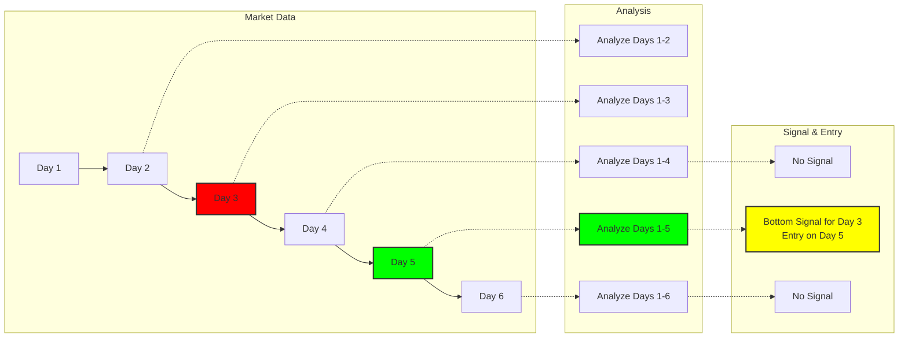

# Market Breadth Trader Design Document

## Overview

This program is a trading bot that automatically executes stock trades based on the overall market strength (Market Breadth) of S&P500 stocks, using moving averages, trends, and signal detection. It performs actual trades using the Alpaca API, with flexible parameter adjustments for signal detection and trading logic.

---

## Key Features

- S&P500 stock price data acquisition (EODHD, Alpaca)
- Market Breadth Index calculation
- Moving average calculation (short/long term, EMA/SMA selectable)
- Trend determination (with hysteresis)
- Signal detection (bottom/peak/background color changes)
- Automated trading based on signals (via Alpaca API)
- Stop loss and trailing stop support
- Log output and progress display

---

## Directory Structure

```
trade/
  run_market_breadth_trade.py   ... Main program
  market_breadth_trade.log      ... Log file
  market_breadth.py            ... Market Breadth calculation module
reports/
  ...                           ... Report output directory
```

---

## Class/Function Structure

### MarketBreadthTrader Class

#### Initialization Parameters
- `short_ma` : Short-term moving average days (default 8)
- `long_ma` : Long-term moving average days (default 200)
- `initial_capital` : Initial capital
- `slippage` : Slippage rate
- `commission` : Commission rate
- `use_saved_data` : Use saved data flag
- `debug` : Debug mode
- `threshold` : Signal detection threshold
- `ma_type` : Moving average type ('ema' or 'sma')
- `symbol` : Trading symbol (e.g., SSO)
- `stop_loss_pct` : Stop loss percentage
- `disable_short_ma_entry` : Disable short MA entry
- `use_trailing_stop` : Use trailing stop
- `trailing_stop_pct` : Trailing stop percentage
- `background_exit_threshold` : Background color signal threshold
- `use_background_color_signals` : Use background color signals
- `partial_exit` : Half exit on signals

#### Main Methods

- `run()`
  - Main loop. Market open/close determination, signal detection, and trade execution.
- `analyze_market()`
  - Data acquisition, Market Breadth calculation, moving average/trend calculation, signal detection.
- `check_signals_and_trade()`
  - Trading decisions and execution based on signals.
- `is_market_open()`
  - Market open determination.
- `is_closing_time_range(range_minutes)`
  - N minutes before market close determination.
- `get_current_position()`
  - Get current position size.
- `get_current_price()`
  - Get current price.
- `execute_buy(shares, reason)`
  - Execute buy order.
- `execute_sell(shares, reason)`
  - Execute sell order.
- `_get_latest_prices_from_alpaca(tickers)`
  - Get latest prices for multiple symbols.
- `_get_latest_price_from_alpaca(ticker)`
  - Get latest price for single symbol.
- `_detect_signals()`
  - Signal detection (bottom/peak/background color changes).
- `_calculate_shares(amount, price)`
  - Calculate number of shares to purchase.

---

## Signal Logic

### Data Period
- Signal detection period is set to 2 years
  - Ensures sufficient data (approximately 400 days) for 200MA calculation
  - Enables accurate bottom and peak detection
  - Balances between data requirements and computational efficiency

### Signal Detection Mechanism

The signal detection process works as follows:

1. **Data Processing Period**
   - Processes data from 2 years ago to present
   - Ensures sufficient historical data for moving average calculations
   - Maintains computational efficiency by limiting the data range

2. **Execution Timing**
   - Signal detection is performed during the last 20 minutes before market close
   - This timing ensures:
     - Market movements for the day are mostly complete
     - More reliable signals can be generated with confirmed price data
     - Signals can be prepared for the next trading day
     - Avoids high volatility periods during market hours
   - The `is_closing_time_range(range_minutes)` method is used to determine the appropriate timing
   - This approach helps reduce false signals and improves signal reliability

3. **Past 20-Day Analysis**
   - When a bottom is detected, looks back 20 days from that date
   - Calculates minimum Market Breadth value for those 20 days
   - Uses the exact date range relative to the detected bottom

4. **Signal Generation**
   - Records the date when a bottom/peak is first detected as the signal date
   - Executes trades only when the signal date matches the current date

5. **Signal Conditions**
   - **Short MA Bottom**: 
     - 8MA below threshold
     - Past 20-day Breadth minimum (from bottom date) below 0.3
   - **Long MA Bottom**: 
     - 200MA below threshold
     - Past 20-day Breadth minimum (from bottom date) below 0.5
   - **Long MA Peak**: 
     - 200MA above 0.5 and peak detected



**Key:**
- 🔴 Day 3: Actual Bottom
- 🟢 Day 5: Signal Detection & Entry

1. **Real-time Detection Approach**
   - Instead of using the actual bottom or peak dates directly as signals
   - Analyzes historical data sequentially and generates signals when bottoms or peaks are detected
   - This means the actual bottoms or peaks are already in the past when signals are generated

2. **Detection Process**
   - Analyzes data sequentially in chronological order
   - Detects bottom and peak patterns from historical data
   - Generates signals at the detection point (actual bottoms or peaks occurred on previous dates)
   - **Time Lag Consideration**: 
     - Peaks and bottoms require time to be confirmed
     - Signals are generated only after sufficient data confirms the pattern
     - This lag ensures more reliable signal generation but means trading slightly after the actual bottom/peak

3. **Advantages**
   - Enables real-time trading decisions
   - Generates reliable signals based on historical data
   - Reduces the risk of false signals
   - Provides confirmation of market reversals before entry

---

## Trading Rules

- Entry/Exit on signal days
- Entry uses half or full capital
- Exit sells all shares (half if `partial_exit` specified)
- Immediate exit on stop loss or trailing stop trigger

---

## Command Line Arguments

| Argument | Description | Default |
|----------|-------------|---------|
| --short_ma | Short-term moving average days | 8 |
| --long_ma | Long-term moving average days | 200 |
| --initial_capital | Initial capital | 50000 |
| --slippage | Slippage | 0.001 |
| --commission | Commission | 0.001 |
| --use_saved_data | Use saved data | False |
| --debug | Debug mode | False |
| --threshold | Signal threshold | 0.5 |
| --ma_type | Moving average type | 'ema' |
| --symbol | Trading symbol | 'SSO' |
| --stop_loss_pct | Stop loss percentage | 0.08 |
| --disable_short_ma_entry | Disable short MA entry | False |
| --use_trailing_stop | Use trailing stop | False |
| --trailing_stop_pct | Trailing stop percentage | 0.2 |
| --background_exit_threshold | Background color signal threshold | 0.5 |
| --use_background_color_signals | Use background color signals | False |
| --partial_exit | Half exit | False |
| --closing_time_minutes | Minutes before market close to execute trades | 20 |

**Note on Trading Symbol (--symbol):**
- Default symbol is 'SSO' (ProShares Ultra S&P 500)
- Selected based on backtest results showing optimal balance between performance and drawdown
- Alternative symbols for risk-averse strategies:
  - 'VOO' (Vanguard S&P 500 ETF)
  - 'QQQ' (Invesco QQQ Trust)
  - 'SCHG' (Schwab U.S. Large-Cap Growth ETF)
- For detailed backtest results, see [Backtest Results Summary](../reports/backtest_results_summary.md)

---

## Dependencies

### External Libraries
- pandas, numpy, matplotlib, scipy, tqdm, alpaca_trade_api, python-dotenv, zoneinfo, logging

### Internal Modules
- `market_breadth.py`: Core module for Market Breadth Index calculation and analysis
  - Provides functions for calculating market breadth indicators
  - Handles data processing and technical analysis
  - Generates market trend signals

---

## Notes

- Alpaca API keys managed in `.env` file
- Logs output to `trade/market_breadth_trade.log`
- Reports saved in `reports/` directory

---

## Execution Example

```bash
python trade/run_market_breadth_trade.py --symbol SSO --use_saved_data --debug
```

### Backtest Results Example


The above image shows a sample backtest result for the Market Breadth Trader. The chart displays:

1. **Price Chart (Top Panel)**
   - Blue line: Actual price movement
   - Green/Red markers: Buy/Sell signals
   - Yellow line: Trailing stop level (when enabled)

2. **Market Breadth Index (Middle Panel)**
   - Blue line: Market Breadth Index
   - Red line: Short-term moving average (8-day)
   - Green line: Long-term moving average (200-day)
   - Gray background: Market trend (white for bullish, pink for bearish)

3. **Position Size (Bottom Panel)**
   - Green bars: Long positions
   - Red bars: Short positions
   - Gray line: Cash position

The system generates buy signals when:
- Market Breadth Index crosses above the short-term MA (short-term bottom)
- Market Breadth Index crosses above the long-term MA (long-term bottom)
- Background color changes from pink to white (trend reversal)

Sell signals are generated when:
- Market Breadth Index crosses below the short-term MA
- Market Breadth Index crosses below the long-term MA
- Background color changes from white to pink
- Stop loss or trailing stop is triggered

---

## Extension/Customization Points

- Adjust signal detection logic thresholds and periods
- Change trading symbols
- Add trading rules (split trading, multiple signal combinations, etc.)

---

